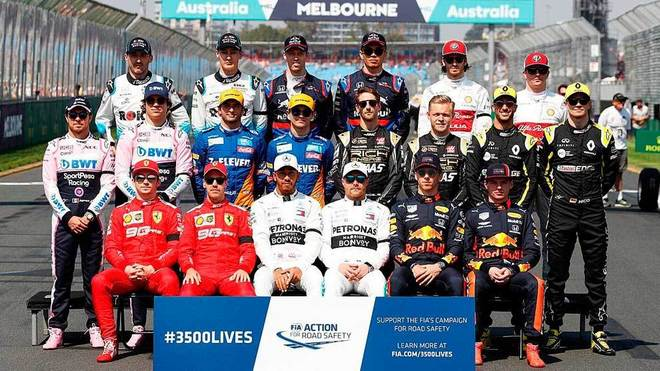

# Pilotos

Asi es la parrilla de pilotos para 2019

Escuderia | Nº | Piloto 1 | Siglas | Nº | Piloto 2 | Siglas
----------|----|------|--------|--------|---------|-----
Mercedes-AMG Petronas Motorsport | 44 | Lewis Hamilton | HAM | 77 | Valtteri Bottas | BOT
Scuderia Ferrari Mission Winnow | 5 | Sebastian Vettel | VET | 16 | Charles Leclerc | LEC
Aston Martin Red Bull Racing | 33 | Max Verstappen | VER | 23 | Alexander Albon | ALB 
Renault F1 Team | 3 | Daniel Ricciardo | RIC | 27 | Nico Hülkenberg | HUL
Haas F1 Team | 8 | Romain Grosjean | GRO | 20 | Kevin Magnussen | MAG
McLaren F1 Team | 55 | Carlos Sainz Jr. | SAI | 4 | Lando Norris | NOR
SportPesa Racing Point F1 Team | 11 | Sergio Pérez | PER | 18 | Lance Stroll | STR
Alfa Romeo Racing | 7 | Kimi Räikkönen | RAI | 99 | Antonio Giovinazzi | GIO
Red Bull Toro Rosso Honda | 10 | Pierre Gasly | GAS | 26 | Daniil Kvyat | KVY
ROKiT Williams Racing | 88 | Robert Kubica | KUB | 63 | George Russell | RUS